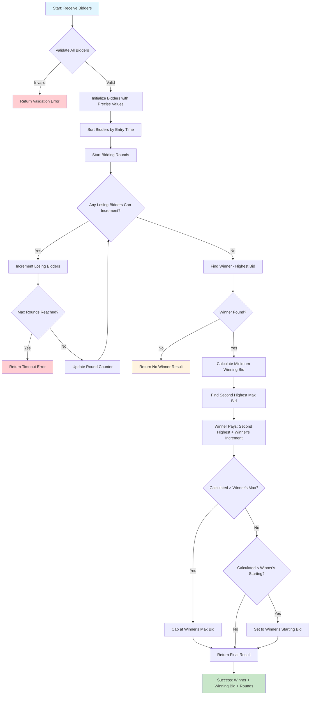

# Auction Bidding Algorithm

[](https://github.com/YOUR_USERNAME/auction-bidding-algorithm/actions)
[](https://codecov.io/gh/YOUR_USERNAME/auction-bidding-algorithm)
[](https://goreportcard.com/report/github.com/YOUR_USERNAME/auction-bidding-algorithm)
[](https://godoc.org/github.com/YOUR_USERNAME/auction-bidding-algorithm)

An automated bidding algorithm for computerized auction sites that determines winning bids by automatically incrementing bidders' current bids based on their maximum bid limits and auto-increment amounts.

## Features

- **Automated Bid Processing**: Iteratively increments losing bidders until no more increments are possible
- **Minimum Winning Bid Calculation**: Determines the lowest amount the winner needs to pay
- **Tie Resolution**: Handles ties by prioritizing earlier entry times
- **Precision Handling**: Uses precise decimal arithmetic for monetary calculations
- **Comprehensive Validation**: Validates all bidder parameters with detailed error reporting
- **Robust Error Handling**: Custom error types with context information

## Quick Start

```go
package main

import (
    "fmt"
    "log"
    "time"

    "github.com/YOUR_USERNAME/auction-bidding-algorithm"
    "github.com/YOUR_USERNAME/auction-bidding-algorithm/internal/models"
)

func main() {
    // Create auction service
    service := auction.NewAuctionService()

    // Create bidders
    bidders := []models.Bidder{
        {
            ID:            "bidder1",
            Name:          "Alice",
            StartingBid:   100.00,
            MaxBid:        500.00,
            AutoIncrement: 25.00,
            EntryTime:     time.Now(),
        },
        {
            ID:            "bidder2",
            Name:          "Bob",
            StartingBid:   110.00,
            MaxBid:        450.00,
            AutoIncrement: 20.00,
            EntryTime:     time.Now().Add(1 * time.Second),
        },
    }

    // Determine winner
    result, err := service.DetermineWinner(bidders)
    if err != nil {
        log.Fatal(err)
    }

    fmt.Printf("Winner: %s\n", result.Winner.Name)
    fmt.Printf("Winning Bid: $%.2f\n", result.WinningBid)
    fmt.Printf("Total Bidders: %d\n", result.TotalBidders)
    fmt.Printf("Bidding Rounds: %d\n", result.BiddingRounds)
}
```

## Development

### Prerequisites

- Go 1.21 or later
- Make (optional, for using Makefile commands)

### Setup

```bash
# Clone the repository
git clone https://github.com/dimaaash/dispatch_test.git
cd dispatch_test


```

### Running Tests

```bash
# Run all tests
make test

# Run tests with coverage
make coverage

```

## Test Suite Overview

The project includes a comprehensive test suite with **100% coverage** for critical components. Here's what each test file covers:

### 🏛️ **Main Package Tests**

- **`auction_test.go`** - Core AuctionService functionality tests including single/multiple bidder scenarios, validation, and edge cases
- **`auction_integration_test.go`** - End-to-end integration tests with mock dependencies to test error handling paths and service orchestration
- **`auction_scenarios_test.go`** - Real-world auction scenarios testing complex bidding flows and business logic
- **`auction_error_test.go`** - Comprehensive error handling tests including validation errors, processing errors, and error context propagation

### ⚙️ **Engine Package Tests**

- **`internal/engine_test.go`** - Core bidding algorithm tests covering bid processing, winner determination, and minimum bid calculations
- **`internal/engine_error_test.go`** - Error handling in the bidding engine including timeout protection and system error scenarios
- **`internal/engine_edge_cases_test.go`** - Edge cases and boundary conditions in bid processing and winner selection

### 🎯 **Precision & Performance Tests**

- **`internal/precision_test.go`** - Floating-point precision handling tests ensuring accurate monetary calculations
- **`internal/precision_verification_test.go`** - Verification that all monetary operations use precise arithmetic to avoid rounding errors

### 📊 **Models Package Tests**

- **`internal/models/bidder_test.go`** - Bidder model tests including creation, increment logic, and precision methods (100% coverage)
- **`internal/models/result_test.go`** - Auction result model tests covering result creation and data consistency (100% coverage)
- **`internal/models/errors_test.go`** - Custom error types and error handling functionality tests (100% coverage)
- **`internal/models/precision_test.go`** - Dollar/cents conversion utilities and precision arithmetic tests (100% coverage)

### ✅ **Validation Package Tests**

- **`internal/validation/validator_test.go`** - Input validation tests covering all bidder parameter validation rules (98.1% coverage)
- **`internal/validation/validator_error_test.go`** - Enhanced validation error handling and error context accumulation tests

### 📈 **Coverage Statistics**

- **Main Package**: 100% statement coverage
- **Models Package**: 100% statement coverage
- **Validation Package**: 98.1% statement coverage
- **Internal Engine**: 63.3% statement coverage
- **Overall Project**: ~81.3% total coverage

### 🧪 **Test Categories**

**Unit Tests**: Test individual functions and methods in isolation

- Bidder creation and manipulation
- Validation logic for all input parameters
- Error type creation and handling
- Precision arithmetic operations

**Integration Tests**: Test component interactions and workflows

- Complete auction processing flows
- Error propagation between layers
- Service orchestration with dependency injection

**Scenario Tests**: Test real-world auction scenarios

- Multi-bidder competitions with complex increment patterns
- Tie resolution with identical bids and timing
- Precision handling with fractional monetary amounts

**Edge Case Tests**: Test boundary conditions and error paths

- Empty bidder lists and single bidder auctions
- Maximum bid limits and increment boundaries
- Timeout protection and system error recovery

### Project Structure

```
.
├── auction.go                          # Main AuctionService interface
├── internal/
│   ├── engine.go                       # Core bidding algorithm
│   ├── models/
│   │   ├── bidder.go                   # Bidder data model
│   │   ├── result.go                   # Auction result model
│   │   ├── errors.go                   # Custom error types
│   │   └── precision.go                # Decimal arithmetic utilities
│   └── validation/
│       └── validator.go                # Input validation
├── .github/workflows/ci.yml            # GitHub Actions CI pipeline
└── Makefile                            # Development commands
```

## CI/CD Pipeline

This project uses GitHub Actions for continuous integration with the following checks:

- **Multi-version Testing**: Tests against Go 1.21 and 1.22
- **Code Coverage**: Maintains minimum 80% test coverage
- **Linting**: Uses golangci-lint for code quality
- **Security Scanning**: Runs gosec for security vulnerabilities
- **Benchmarking**: Performance regression detection
- **Dependency Verification**: Ensures module integrity

### Coverage Reports

Coverage reports are automatically generated and uploaded to:

- **Codecov**: For detailed coverage analysis and trends
- **GitHub Artifacts**: Raw coverage files for each Go version

## Algorithm Details

### Bidding Process Flow

The auction algorithm follows a systematic process to determine the winner and calculate the minimum winning bid:



### Step-by-Step Process

1. **Input Validation**: All bidder parameters are validated for correctness
2. **Initialization**: Bidders are converted to precise arithmetic and sorted by entry time
3. **Iterative Bidding**: Losing bidders increment their bids until no more increments are possible
4. **Winner Selection**: Highest bidder wins (earliest entry time breaks ties)
5. **Minimum Bid Calculation**: Winner pays just enough to beat the second-highest bidder
6. **Result Generation**: Return comprehensive auction results with all bidder states

### Precision Handling

All monetary calculations use precise integer arithmetic (cents) to avoid floating-point precision issues:

```go
// Convert dollars to cents for precise calculations
cents := models.DollarsToCents(10.99) // 1099 cents

// Perform calculations in cents
result := cents + models.DollarsToCents(0.25) // 1124 cents

// Convert back to dollars
dollars := models.CentsToDollars(result) // 11.24
```
